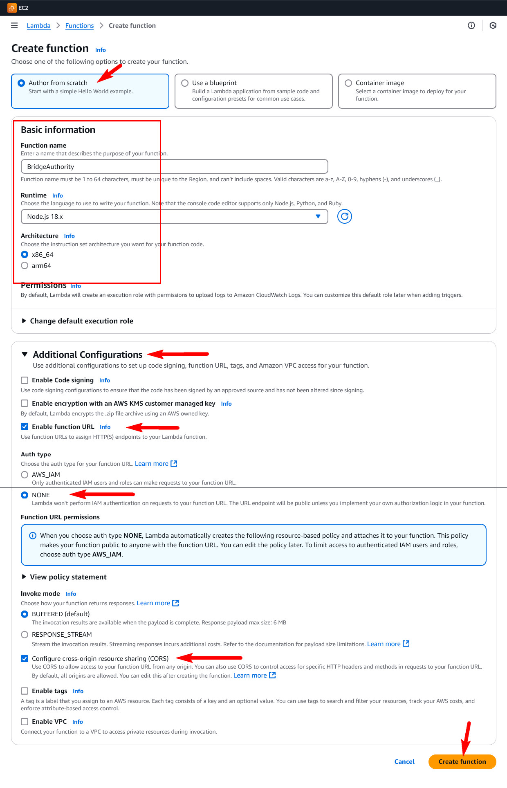

# Setup Authority on AWS Lambda

1. Create [AWS](https://aws.amazon.com/) account or use existing. Can be used free account as well. You can use [free tier account](https://analyticshut.com/create-aws-account/) for this purpose.

2. Optionally you can update [index.js](https://github.com/Degenswap/Bridge/blob/master/AWS_Lambda/index.js) [RPC providers](https://github.com/yuriy77k/CallistoBridge/blob/f73fccc5232f5e987f163a1fa745d34a1f6a6869/server/AWS_Lambda/index.js#L38-L48) list with your own RPC (if you have). If you are using RPC from [Infura.io](https://github.com/yuriy77k/CallistoBridge/blob/f73fccc5232f5e987f163a1fa745d34a1f6a6869/server/AWS_Lambda/index.js#L44-L45) add your project ID to the link. I.e. `https://mainnet.infura.io/v3/123456789`, where: `123456789` is your project ID from Infura. 

And add updated `index.js` to archive [aws_lambda.zip](./aws_lambda.zip)

3. Create Lambda function like on the screenshot.

4. Copy `URL` - it's your authority API entrypoint. 

5. Upload `aws_lambda.zip` (authority code) to the server.

6. Open `Configuration` tab and `Environment variables` in it. Click `Edit`.

7. Add environment variable `AUTHORITY_PK` and `private key` of your Authority wallet.

