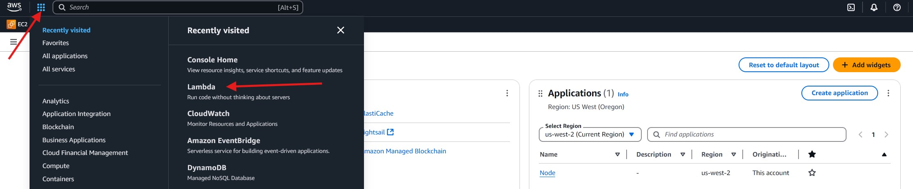

# Setup Authority on AWS Lambda

1. Create [AWS](https://aws.amazon.com/) account or use existing one. Can be used free account as well. You can use [free tier account](https://analyticshut.com/create-aws-account/) for this purpose.

2. Download archive [aws_lambda.zip](https://github.com/yuriy77k/CallistoBridge/raw/refs/heads/main/server/AWS_Lambda/aws_lambda.zip) to your computer. Optionally you can modify [authorityV2.js](https://github.com/yuriy77k/CallistoBridge/tree/main/server/AWS_Lambda/authorityV2.js) [RPC providers](https://github.com/yuriy77k/CallistoBridge/tree/main/server/AWS_Lambda/authorityV2.js#L7-L56) list with your own RPC (if you have it). 
And add updated `authorityV2.js` to archive [aws_lambda.zip](./aws_lambda.zip)

3. Create Lambda function (Node 18.x) like on the screenshot.

4. Copy `URL` - it's your authority API entrypoint. 

5. Upload `aws_lambda.zip` (authority code) to the server.

6. Open `Configuration` tab and `Environment variables` in it. Click `Edit`.

7. Add environment variable `AUTHORITY_PK` and `private key` of your Authority wallet.

