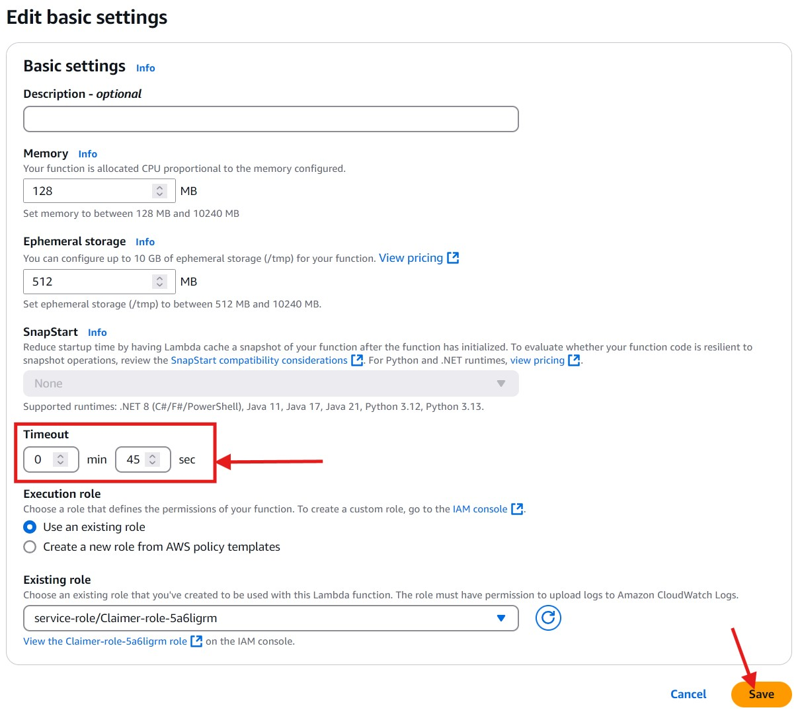

# Claimer script
1. Download archive [claimer_aws_lambda.zip](https://github.com/yuriy77k/CallistoBridge/raw/refs/heads/main/server/AWS_Lambda/claimer/claimer_aws_lambda.zip)
2. Create AWS Lambda function `BridgeClaimer` in the same way like Authority.
3. Upload `claimer_aws_lambda.zip`.
4. Open `Configuration` tab and `Environment variables` in it. Click `Edit`.
5. Add environment variable `CLAIMER_PK` and `private key` of your wallet witch will send claim transaction.
6. Open `Configuration` tab and `General configuration` in it. Click `Edit`.
7. Set timeout to 45 sec and click `Save`.
